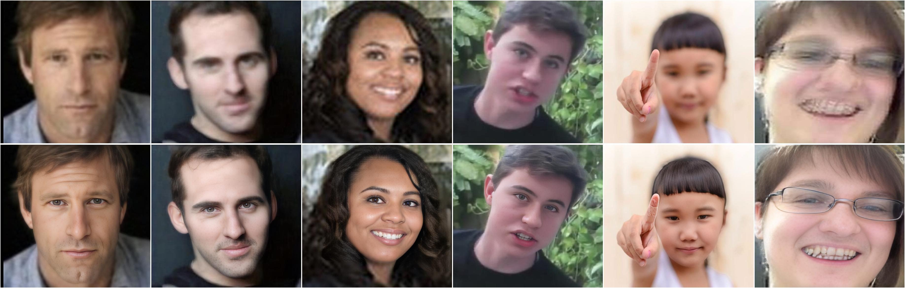

# revive: GAN-based Face Image Enhancement

###### **revive**: is a simplified version of the well-known [GFPGAN](https://github.com/TencentARC/GFPGAN). The primary goal of revive is to make GFPGAN's powerful face restoration capabilities more accessible by providing an easier setup, training, and inference pipeline. It directly utilizes GFPGAN's core models and pre-trained weights(for time being), aiming to offer a more readily usable package for high-quality face enhancement. Notably, you can utilize the complete Revive pipeline provided in this project to train or fine-tune your own face enhancement models.

revive focuses on enhancing face images using Generative Adversarial Networks (GANs). It aims to restore and improve the quality of facial images by addressing degradations, improving resolution, and enhancing key facial features. It is build upon the BasicSR framework and incorporates various state-of-the-art components, including StyleGAN2, ArcFace (for identity preservation), face detection, and facial landmark parsing for targeted enhancements.




> The training was conducted using the FFHQ dataset to ensure diversity and high-quality face representation.
## Installation

1.  **Clone the Repository:**
    ```bash
    git clone https://github.com/sorohere/revive.git
    cd revive
    ```

2.  **Create a Virtual Environment (Recommended):**
    ```bash
    virtualenv venv # On Windows use `python -m venv venv`
    source venv/bin/activate  # On Windows use `venv\Scripts\activate`
    ```

3.  **Setup for traning and inference:**
    Install the required Python packages using pip:
    ```bash
    bash setup.sh
    ```

### Inference

To enhance face images using a trained model, **Command:**
```bash
python inference_revive.py -i inputs/whole_imgs -o results -v v1.1 -s 2
```

**Explanation of Arguments:**

*   `-i`: Path to the directory containing input images.
*   `-o`: Path to the directory where enhanced images will be saved.
*   `-v`: Model version or identifier (e.g., `v1.1`, `v1.3`). This helps the script load the correct trained model weights.
*   `-s`: A parameter that can signify an upscaling factor, tile size, or another inference-specific setting. Refer to `inference_revive.py` for its exact interpretation.

### Training

The training process uses the BasicSR framework and is configured via YAML files located in the `options/` directory. To start training,
**Command:**


```bash
torchrun --nproc_per_node=4 --master_port=22021 revive/train.py -opt options/train_revive_v1.yml
```

**Explanation:**

*   `torchrun`: PyTorch utility for distributed training.
*   `--nproc_per_node=4`: Number of processes (GPUs) to use for training.
*   `--master_port=22021`: Port for the master process in distributed training.
*   `revive/train.py`: The main training script.
*   `-opt options/train_revive_v1.yml`: Specifies the configuration file for the training session. This file contains settings for datasets, network architectures, optimizers, loss functions, and logging.

**Configuration:**

Modify the YAML files in the `options/` directory (e.g., `train_revive_v1.yml`) to customize:
*   Dataset paths and degradation types (`ffhq_degradation_dataset.py`).
*   Generator and discriminator architectures (`revive/archs/`).
*   Learning rates, batch sizes, and other training parameters.
*   Loss function weights (pixel, adversarial, perceptual, identity).

-Can be improved by transfer learning (obviously 😉)
